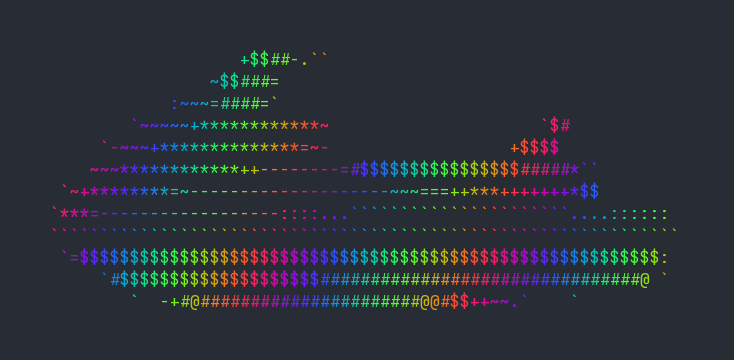

# jetski

A Go library that converts images (PNG, JPEG, BMP) into ASCII art, with an optional RGB sine-wave color gradient via the companion **waverunner** API.

```sh
go run ./src -color ./src/images/jetski.png
```

### with


### becomes



---

## Quick start

### Install
```sh
go get github.com/dchill72/jetski
```

### Use
```go
import "github.com/dchill72/jetski"

f, _ := os.Open("photo.png")
defer f.Close()

art, err := jetski.Convert(f, jetski.Options{Width: 120})
fmt.Print(art)
```

---

## jetski — image to ASCII

### `Convert`

```go
func Convert(r io.Reader, opts Options) (string, error)
```

Decodes an image from `r` and returns a newline-delimited ASCII-art string. Height is derived automatically from the image's aspect ratio and a terminal font-aspect correction (characters are ~2× taller than wide).

### `ConvertGrid`

```go
func ConvertGrid(r io.Reader, opts Options) ([][]byte, error)
```

Same as `Convert` but returns the raw `[][]byte` character grid instead of a string. Pass the grid to `Colorize` to apply an RGB gradient, or to `GridToString` to get a plain string later without re-decoding the image.

### `Options`

| Field | Type | Default | Description |
|-------|------|---------|-------------|
| `Width` | `int` | `80` | Output column count. Height is computed to preserve aspect ratio. |
| `Chars` | `string` | `"@#$*+=~-:.\` "` | Luminance ramp, darkest character first. Ignored when `Renderer` is set. |
| `Renderer` | `Renderer` | `nil` | Custom per-pixel function `func(r, g, b uint8) string`. Receives original RGB; overrides `Chars`, `Gamma`, `Equalize`, and `Brightness`. |
| `Brightness` | `float64` | `0.5` | Overall luminance offset. `0.0` = darkest, `0.5` = neutral, `1.0` = lightest. Zero value treated as `0.5`. |
| `Gamma` | `float64` | `0` | Power-curve on luminance. `<1` brightens, `>1` darkens. `0` and `1` are identity. |
| `Equalize` | `bool` | `false` | Histogram-equalizes luminance before mapping. Best for images whose tones are concentrated in a narrow band (e.g. low-contrast photos). |

`Brightness`, `Gamma`, and `Equalize` only affect the built-in grayscale renderer. They are applied in this order: equalize → gamma → brightness.

### Default character ramp

```
@ # $ * + = ~ - : . ` (space)
█ ▓ ▓ ▒ ▒ ░ ░ ░ · ·
```

Twelve characters chosen for maximum visual weight separation between adjacent steps. Supply your own via `Chars` — fewer characters produces harder contrast; more produces smoother gradients.

### Custom renderer

`Renderer` gives full control over per-pixel output, including ANSI colour codes:

```go
art, _ := jetski.Convert(f, jetski.Options{
    Width: 100,
    Renderer: func(r, g, b uint8) string {
        // emit the pixel's true colour as ANSI 24-bit foreground
        luma := 0.299*float64(r) + 0.587*float64(g) + 0.114*float64(b)
        chars := "@#$*+=~-:." + "` "
        ch := chars[int(luma)*len(chars)/256]
        return fmt.Sprintf("\x1b[38;2;%d;%d;%dm%c\x1b[0m", r, g, b, ch)
    },
})
```

---

## waverunner — RGB sine-wave gradient

The waverunner API applies a spatial RGB colour gradient to any `[][]byte` character grid. It uses three sine waves with 120° phase offsets to produce a smooth, continuously cycling rainbow across the output.

### `Colorize`

```go
func Colorize(grid [][]byte, opts WaveOptions) string
```

Wraps every character in `grid` with an ANSI 24-bit foreground colour escape sequence. Returns a terminal-printable string. The colour at each cell is:

```
φ = 2π · (col·cos(angle) + row·sin(angle)) / period + phase

R = 128 + amplitude · sin(φ)
G = 128 + amplitude · sin(φ + 120°)
B = 128 + amplitude · sin(φ + 240°)
```

### `GridToString`

```go
func GridToString(grid [][]byte) string
```

Converts a raw character grid to a plain (uncoloured) string. Useful when you want to toggle between plain and coloured output without decoding the image twice.

### `WaveOptions`

| Field | Type | Default | Description |
|-------|------|---------|-------------|
| `Angle` | `float64` | `0` | Wave direction in degrees. `0` = horizontal bands, `90` = vertical bands, `45` = diagonal. |
| `Phase` | `float64` | `0` | Phase offset in radians. Shift the entire colour cycle. Increment each frame to animate. |
| `Period` | `float64` | `16` | Wavelength in character cells. Smaller = tighter bands, larger = slow sweep. |
| `Range` | `float64` | `1.0` | Colour saturation amplitude `[0, 1]`. `0` = gray, `1` = fully saturated. Zero value treated as `1.0`. |

### Coloured output example

```go
f, _ := os.Open("photo.png")
defer f.Close()

grid, err := jetski.ConvertGrid(f, jetski.Options{
    Width:    120,
    Equalize: true,
})
if err != nil {
    log.Fatal(err)
}

colored := jetski.Colorize(grid, jetski.WaveOptions{
    Angle:  45,
    Period: 24,
    Range:  0.8,
})
fmt.Print(colored)
```

### Animation loop

Increment `Phase` each frame to scroll the gradient:

```go
grid, _ := jetski.ConvertGrid(f, jetski.Options{Width: 100, Equalize: true})

for phase := 0.0; ; phase += 0.15 {
    fmt.Print("\x1b[H") // move cursor to top-left
    fmt.Print(jetski.Colorize(grid, jetski.WaveOptions{
        Angle:  45,
        Period: 20,
        Phase:  phase,
        Range:  1.0,
    }))
    time.Sleep(50 * time.Millisecond)
}
```

---

## CLI test harness (`src/`)

A small command-line program in `src/` exercises the full API:

```
go run ./src/ [flags] <image>

Flags:
  -width       int     output column width (default 80)
  -brightness  float   luminance shift: 0.0 dark → 0.5 neutral → 1.0 light (default 0.5)
  -gamma       float   power curve: <1 lighter, >1 darker, 0=off
  -equalize            apply histogram equalization
  -color               apply RGB wave gradient (requires a terminal with 24-bit colour)
  -angle       float   wave angle in degrees (default 45)
  -phase       float   wave phase offset in radians (default 0)
  -period      float   wave period in character cells (default 16)
  -saturation  float   colour saturation 0–1 (default 1)
```

Example images live in `src/images/`.

```sh
# plain grayscale
go run ./src/ src/images/photo.png

# equalized with a brightness boost
go run ./src/ -equalize -brightness 0.6 src/images/photo.png

# diagonal rainbow gradient
go run ./src/ -color -equalize -angle 45 -period 30 src/images/photo.png

# desaturated vertical gradient, wider output
go run ./src/ -color -equalize -angle 90 -saturation 0.5 -width 140 src/images/photo.png
```

---

## Supported formats

| Format | Notes |
|--------|-------|
| PNG | via `image/png` |
| JPEG | via `image/jpeg` |
| BMP | via `golang.org/x/image/bmp` |

Any format registered with Go's `image` package before calling `Convert` / `ConvertGrid` will also work.
